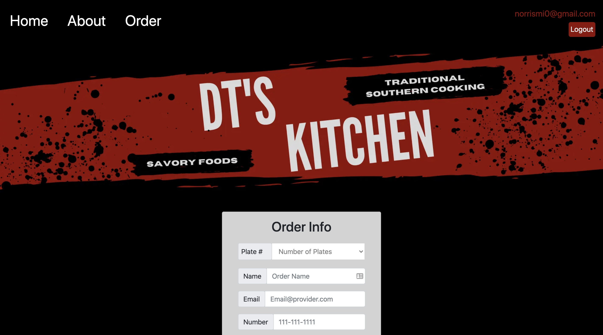

# DT's Kitchen


## Technology used
- Next.js (ES6 & React Hooks)
- Firebase/ Firestore
- Firebase Authentication
- React Hook Form
- EmailJS
- Bootstrap
- CSS (Mobile-first responsive design)


## Project Screen Shots




## Reflection

The goal of the project was to help a client streamline food orders, but also have a controlled website to compliment with his part time cooking side hustle. 
<br />

The obstacles that I overcame with this project was creating a website that is open part time at the client's discretion, database design and improving my communication with the client.
 
To meet the part time role of this company, I created a boolean toggle on the database that serves up a different view, away from the user authentication view. This toggle along with other conditional toggles directs the customers away from placing food orders when the kitchen is closed. 
 
Creating the Firestore database was also a small hurdle I overcame. Yes, there is a small learning curve to Firestore, but the bigger challenge I ran into was database structure for the food menu. I have learnt, it is nice to have a database framework going into a project, just like a website design framework. After several different database design trials, my solution was to set the food type (Ex. protein) as a collection with different object fields (Ex. item: "chicken $4.50")
 
Finally, one last challenge I wanted to improve upon was my "communication/ people skills". The client is of a younger generation which made it easy to provide updates via text messages rather than making calls all of the time. The client was extremely easy to work with. I stressed the importance of being on the same page at the beginning of the project and getting an initial color scheme and site design helped. Throughout the development I provided updates to make sure the client was comfortable with the website.

<br />


This is a [Next.js](https://nextjs.org/) project bootstrapped with [`create-next-app`](https://github.com/vercel/next.js/tree/canary/packages/create-next-app).

## Getting Started

First, run the development server:

```bash
npm run dev
# or
yarn dev
```

Open [http://localhost:3000](http://localhost:3000) with your browser to see the result.

You can start editing the page by modifying `pages/index.js`. The page auto-updates as you edit the file.

[API routes](https://nextjs.org/docs/api-routes/introduction) can be accessed on [http://localhost:3000/api/hello](http://localhost:3000/api/hello). This endpoint can be edited in `pages/api/hello.js`.

The `pages/api` directory is mapped to `/api/*`. Files in this directory are treated as [API routes](https://nextjs.org/docs/api-routes/introduction) instead of React pages.

## Learn More

To learn more about Next.js, take a look at the following resources:

- [Next.js Documentation](https://nextjs.org/docs) - learn about Next.js features and API.
- [Learn Next.js](https://nextjs.org/learn) - an interactive Next.js tutorial.

You can check out [the Next.js GitHub repository](https://github.com/vercel/next.js/) - your feedback and contributions are welcome!

## Deploy on Vercel

The easiest way to deploy your Next.js app is to use the [Vercel Platform](https://vercel.com/new?utm_medium=default-template&filter=next.js&utm_source=create-next-app&utm_campaign=create-next-app-readme) from the creators of Next.js.

Check out our [Next.js deployment documentation](https://nextjs.org/docs/deployment) for more details.
